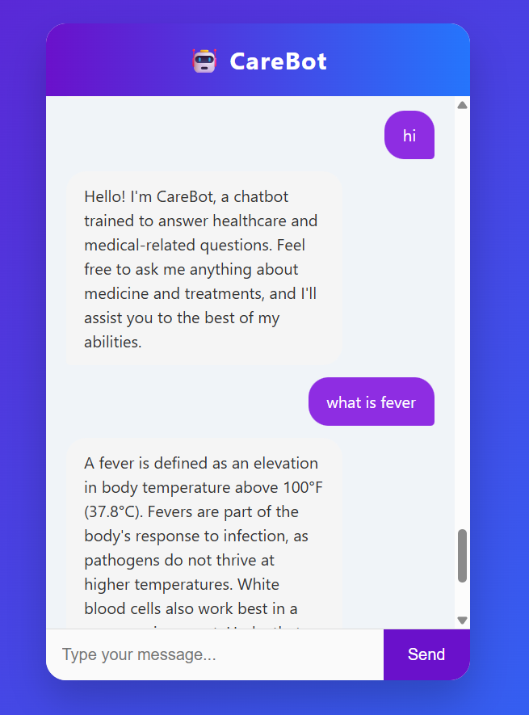
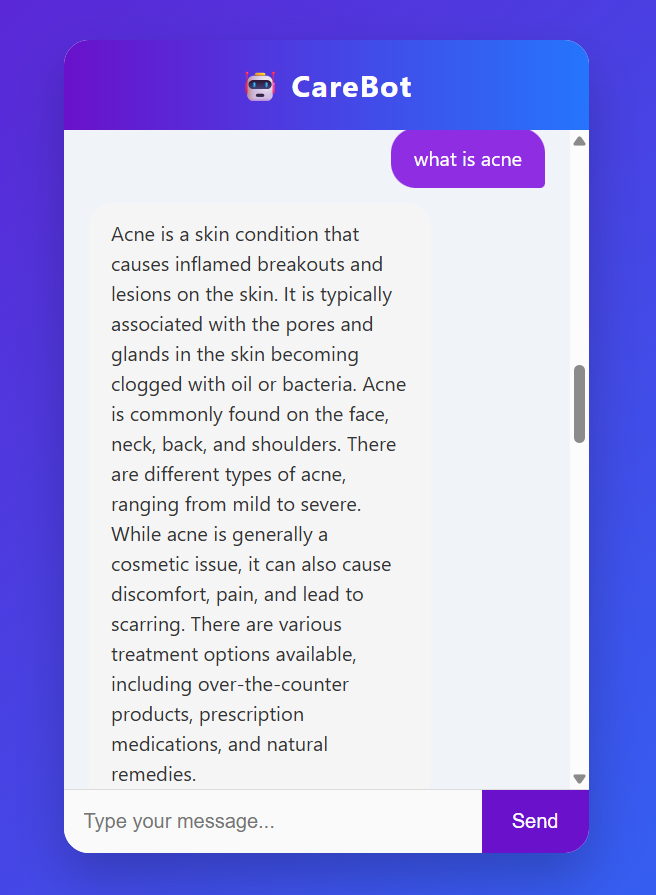
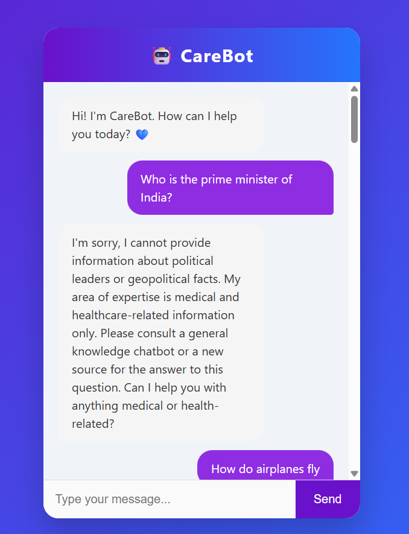

# 🩺 CareBot — End-to-End Medical Generative AI Chatbot

CareBot is an intelligent chatbot designed to answer medical questions using Retrieval-Augmented Generation (RAG) powered by **LangChain**, **Cohere**, **HuggingFace embeddings**, and **Pinecone**. It provides accurate and relevant answers by retrieving information from your trained medical book (PDF).


## 🚀 How to Run?

### ✅ Step 01: Clone the Repository

```bash
git clone https://github.com/Ranjani210725/end-to-end-care-generative-AI/tree/main
cd end-to-end-care-generative-AI
````

---

### ✅ Step 02: Create Conda Environment

```bash
conda create -n carebot python=3.13 -y
conda activate carebot
```
---

### ✅ Step 03: Install Requirements

```bash
pip install -r requirements.txt
```
---

### ✅ Step 04: Setup Environment Variables

Create a `.env` file in the root folder and add your API keys:

```env
PINECONE_API_KEY=your_pinecone_key
COHERE_API_KEY=your_cohere_key
```

---

### ✅ Step 05: Run the App

```bash
python app.py
```

Then open your browser and visit:
**[http://localhost:8080](http://localhost:8080)**





---

## 🧠 How It Works

1. Load and split the medical PDF
2. Embed text using HuggingFace embeddings
3. Store vectors in Pinecone
4. Retrieve relevant text chunks based on the query
5. Generate an answer using Cohere's LLM

---

## 💬 Sample Questions

* "What is a peptic ulcer?"
* "How do you treat a migraine?"
* "What are symptoms of pneumonia?"
* "Is hypertension dangerous?"

---

## 📁 Folder Structure

end-to-end-care-generative-AI/
│
├── Data/
│   └── medical_book.pdf               # Medical knowledge base PDF
│
├── research/
│   └── trials.ipynb                   # Research notebook for experimentation
│
├── screenshots/
│   ├── demo1.png                      # UI demo screenshot 1
│   ├── demo2.png                      # UI demo screenshot 2
│   └── demo3.png                      # UI demo screenshot 3
│
├── src/
│   ├── __init__.py                    # Initializes the src package
│   ├── helper.py                      # Utility functions (PDF loading, chunking)
│   └── prompt.py                      # Prompt template used in LLM interaction
│
├── static/
│   └── style.css                      # Styling for the chatbot interface
│
├── templates/
│   └── chat.html                      # Frontend HTML for chatbot UI
│
├── app.py                             # Main Flask app
├── store_index.py                     # Embedding & vector index storage
├── test.py                            # Test script (can be expanded)
│
├── README.md                          # Project documentation
├── requirements.txt                   # Dependency list
├── setup.py                           # Optional project setup script
├── .env                               # Environment variables (e.g., API keys)
├── .gitignore                         # Files to be ignored by Git
└── LICENSE                            # Open-source license


---

## 📬 Contact

For help or questions, feel free to reach out: `ranjani.c.official@gmail.com`
